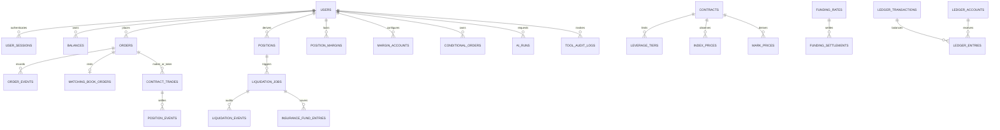

# 核心 ERD

```mermaid
erDiagram
  USERS ||--o{ USER_SESSIONS : authenticates
  USERS ||--o{ BALANCES : owns
  USERS ||--o{ ORDERS : places
  ORDERS ||--o{ ORDER_EVENTS : records
  ORDERS ||--o| MATCHING_BOOK_ORDERS : rests
  ORDERS ||--o{ CONTRACT_TRADES : maker_or_taker
  USERS ||--o{ POSITIONS : derives
  CONTRACT_TRADES ||--o{ POSITION_EVENTS : settles
  USERS ||--o{ POSITION_MARGINS : locks
  USERS ||--o{ MARGIN_ACCOUNTS : configures
  CONTRACTS ||--o{ LEVERAGE_TIERS : limits
  CONTRACTS ||--o{ INDEX_PRICES : observes
  CONTRACTS ||--o{ MARK_PRICES : derives
  POSITIONS ||--o{ LIQUIDATION_JOBS : triggers
  LIQUIDATION_JOBS ||--o{ LIQUIDATION_EVENTS : audits
  LIQUIDATION_JOBS ||--o{ INSURANCE_FUND_ENTRIES : covers
  FUNDING_RATES ||--o{ FUNDING_SETTLEMENTS : settles
  LEDGER_TRANSACTIONS ||--o{ LEDGER_ENTRIES : balances
  LEDGER_ACCOUNTS ||--o{ LEDGER_ENTRIES : receives
  USERS ||--o{ CONDITIONAL_ORDERS : owns
  USERS ||--o{ AI_RUNS : requests
  USERS ||--o{ TOOL_AUDIT_LOGS : invokes
```

完整字段和约束以 `migrations/00001_initial.sql` 到 `00016_tool_audit.sql` 为唯一 schema 真值；`data-dictionary.md` 解释业务含义。
